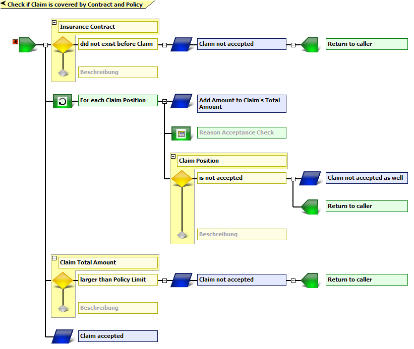

# Metode dan Desain {#metode-dan-desain}

_Business process management system_ (BPMS) [1] merupakan teknologi perangkat lunak yang diciptakan untuk membantu aktivitas-aktivitas yang kompleks tersebut. Mesin aturan (_rule engine_) merupakan bagian dari BPMS yang berfungsi sebagai pengambil keputusan dari masukan dan kejadian yang ada, untuk melanjutkan ke tugas berikutnya. Mesin aturan juga dikembangkan secara _hybrid_, seperti heart yang berbasis XTT2 [3].

Mesin aturan semantik ini akan dikembangkan dengan spesifikasi sebagai berikut:

1.  Business process management framework: jBPM [4]
2.  Rule engine: Drools
3.  Ontologi semantik: Lumen [5] dan YAGO [6]

